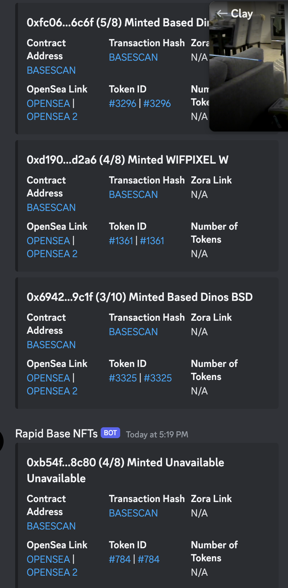

### Website Inventory Monitors
[HibBet Monitor](./hibbetttest.js)
- Spoofs real users using dynamic authourizations.
- Uses proxys to mask traffic from a single location.
- [Related keywords file.](./keywords.json)

[Toys'R'Us Product Inventory Monitor](./toysrusStockCheck.js)
- Checks inventory of a product.

[PS5 Checkout](./ps5checkouts.png)
- The results of a checkout bot I coded for BestBuy. Enabled me to get PS5s during a high demand period.

### Web3
#### NFT Monitors For Reselling

[Rapid Base Wallet Monitor](./rapid-base-walletwatcher.js)
- Node.js application that interacts with the Ethereum blockchain and a Discord bot.

#### Some Selfmade NFT Projects
These are just some self-made NFT projects I've done.
[ScalarPlanets](https://solscan.io/collection/1af61b23a0889f43a3256a5573a9d38c0532beb24f63628acd14a9bde71318e0)

GorKillaz
