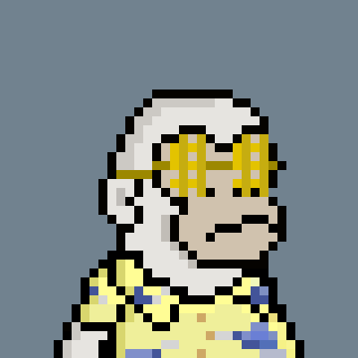

## Current Experience
- Developing a MMO community driven video game using 3d environments.
[Ducks](https://github.com/ClaytonWas/Ducks)
  

- Developing a WebApp for photo manipulation.
[WebappPhotoedits](https://github.com/ClaytonWas/WebappPhotoedits)

## Previous Experience
### School Projects
[Biodiversity Monitor](https://github.com/ClaytonWas/AI_Powered_Biodiversity_Monitoring_System)
- Uses Azure machine learning and computer vision software to analyze an areas biodiversity.

[Simulation of Ecosystem Food Chains](https://github.com/ClaytonWas/Simulation-of-Ecosystem-Food-Chains)
- Course project for Simulation and Modelling that has accurate trophic level flow.
- In-depth animal AI included tiredness, hunger, thirst, and relative danger variables.

[TypeRacer Websocket](https://github.com/ClaytonWas/TypeRacer-Websocket)
- Web application to race against your friends and see who the faster typer is!

### Website Inventory Monitors
[HibBet Monitor](./hibbetttest.js)
- Spoofs real users using dynamic authourizations.
- Uses proxys to mask traffic from a single location.
- [Related keywords file.](./keywords.json)

[Toys'R'Us Product Inventory Monitor](./toysrusStockCheck.js)
- Checks inventory of a product.

PS5 Checkout Bot
- The results of a checkout bot I coded for BestBuy. Enabled me to get PS5s during a high demand period.

### Web3
#### NFT Monitors For Reselling

[Rapid Base Wallet Monitor](./rapid-base-walletwatcher.js)
- Node.js application that interacts with the Ethereum blockchain and a Discord bot.

#### Some Selfmade NFT Projects
These are just some self-made NFT projects I've done.  
[ScalarPlanets](https://solscan.io/collection/1af61b23a0889f43a3256a5573a9d38c0532beb24f63628acd14a9bde71318e0)  

 
GorKillaz  

